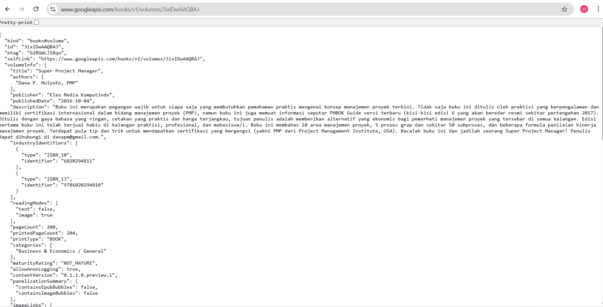

# Pemrograman Asynchronous di Flutter

## PRAKTIKUM 1: Mengunduh Data dari Web Service (API)

**Deskripsi:**

Aplikasi ini mengimplementasikan cara mengambil atau mengunduh data dari sebuah Web Service API menggunakan Flutter.

## Soal 1 :
Tambahkan nama panggilan Anda pada title app sebagai identitas hasil pekerjaan Anda.

#### Mengganti Tittle 

## Soal 2 :
Carilah judul buku favorit Anda di Google Books, lalu ganti ID buku pada variabel path di kode tersebut. 

#### Mengganti ID Buku

