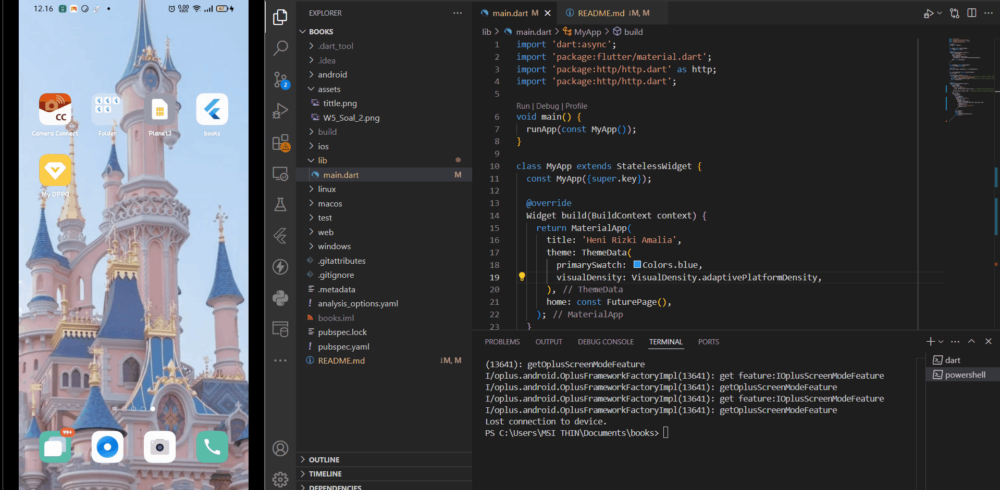
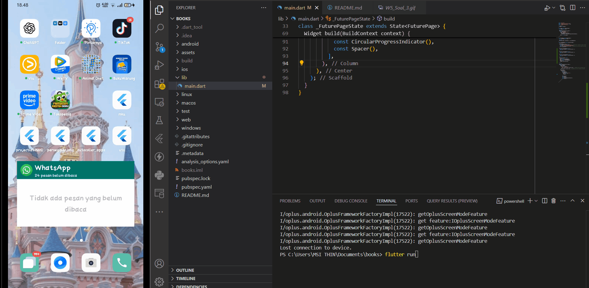
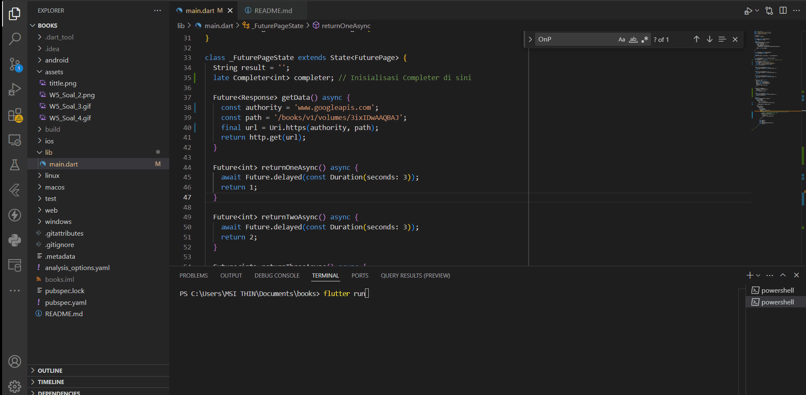

# Pemrograman Asynchronous di Flutter

## PRAKTIKUM 1: Mengunduh Data dari Web Service (API)

**Deskripsi:**

Aplikasi ini mengimplementasikan cara mengambil atau mengunduh data dari sebuah Web Service API menggunakan Flutter.

## Soal 1 :
Tambahkan nama panggilan Anda pada title app sebagai identitas hasil pekerjaan Anda.

#### Mengganti Tittle 

## Soal 2 :
Carilah judul buku favorit Anda di Google Books, lalu ganti ID buku pada variabel path di kode tersebut. 

#### Mengganti ID Buku

## Soal 3: Penjelasan `substring` dan `catchError` pada Langkah 5

**Pertanyaan:** Jelaskan maksud kode langkah 5 tersebut terkait `substring` dan `catchError`!

**Jawaban:**

Kode di dalam blok `onPressed` dari `ElevatedButton` memiliki fungsi utama untuk mengambil data dan menanganinya:

1.  **Pengambilan Data (`getData()`):** Ketika tombol "GO!" ditekan, fungsi `getData()` dipanggil untuk melakukan permintaan data (kemungkinan dari sebuah API). Proses ini bersifat asinkron.

2.  **Penanganan Data Sukses (`.then((value) { ... })`):** Jika `getData()` berhasil mendapatkan respons:
    * `value.body.toString()`: Isi dari respons diubah menjadi format `String`.
    * `.substring(0, 450)`: **Fungsi `substring(0, 450)`** digunakan untuk mengekstrak dan mengambil hanya 450 karakter pertama dari string isi respons. Tujuannya adalah untuk membatasi jumlah data yang ditampilkan atau mengambil cuplikan awal.
    * Hasil potongan string ini kemudian disimpan ke dalam variabel `result` dan ditampilkan pada antarmuka pengguna melalui `setState(() {})`.

3.  **Penanganan Error (`.catchError((_) { ... })`):** Jika terjadi kesalahan selama proses `getData()` (misalnya, koneksi gagal):
    * **Fungsi `catchError((_) { ... })`** akan menangkap error tersebut.
    * Variabel `result` akan diubah menjadi pesan error statis: `"An error occurred"`.
    * Pesan error ini kemudian ditampilkan pada antarmuka pengguna melalui `setState(() {})`.

**Kesimpulan:**

* **`substring(0, 450)`:** Bertugas untuk membatasi dan menampilkan hanya 450 karakter pertama dari data yang berhasil diterima, berguna untuk menyajikan ringkasan atau mencegah tampilan yang terlalu panjang.
* **`catchError((_) { ... })`:** Berfungsi sebagai mekanisme penanganan error. Jika terjadi masalah saat pengambilan data, kode ini akan menampilkan pesan error yang lebih informatif kepada pengguna daripada aplikasi yang berhenti tiba-tiba.

#### Hasil Praktikum

## PRAKTIKUM 2: Menggunakan await/async untuk menghindari callbacks

## Soal 4: 

**Pertanyaan:** Jelaskan maksud kode langkah 1 dan 2 tersebut!

**Jawaban:**

***Langkah 1:** 
Pada langkah pertama ini bertujuan untuk mendefinisikan tiga fungsi asinkron (returnOneAsync, returnTwoAsync, returnThreeAsync) yang masing-masing mensimulasikan operasi yang membutuhkan waktu 3 detik. Setiap fungsi mengembalikan sebuah Future<int> yang akan menghasilkan nilai integer (1, 2, dan 3 secara berurutan) setelah penundaan selesai. Ini mengilustrasikan pembuatan operasi independen yang berjalan secara tidak memblokir.

***Langkah 2:** 
Pada langkah kedua ini yaitu menambahkan fungsi asinkron count() yang menggunakan async dan await untuk memanggil ketiga fungsi dari Langkah 1 secara berurutan. await memastikan bahwa setiap fungsi Future selesai sebelum fungsi berikutnya dipanggil. Hasil dari setiap Future dijumlahkan ke dalam variabel total. Terakhir, setState() digunakan untuk memperbarui tampilan UI dengan nilai total yang telah dikonversi menjadi string, menunjukkan bagaimana mengelola dan menggabungkan hasil dari beberapa operasi asinkron dan merefleksikannya pada antarmuka pengguna.

#### Hasil Praktikum 

## Soal 5: 

**Pertanyaan:** Jelaskan maksud kode langkah 2 tersebut!

**Jawaban:**
 Pada Kode Langkah 2 ini memperkenalkan Completer sebagai mekanisme untuk mengelola penyelesaian operasi asinkron secara manual. getNumber() membuat sebuah Completer dan mengembalikan Future yang terkait dengannya. Operasi yang sebenarnya (simulated by calculate()) dilakukan secara terpisah dan, setelah selesai (dalam hal ini, setelah penundaan 5 detik), completer.complete(42) dipanggil untuk menandakan bahwa Future telah berhasil diselesaikan dengan nilai 42. Ini memberikan kontrol eksplisit atas kapan dan bagaimana sebuah Future diselesaikan, yang berguna untuk menangani operasi asinkron yang penyelesaiannya tidak terjadi secara langsung atau dikelola oleh bagian kode yang berbeda.

#### Hasil Praktikum 

