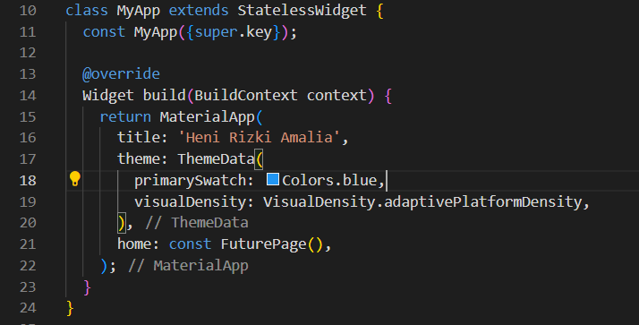
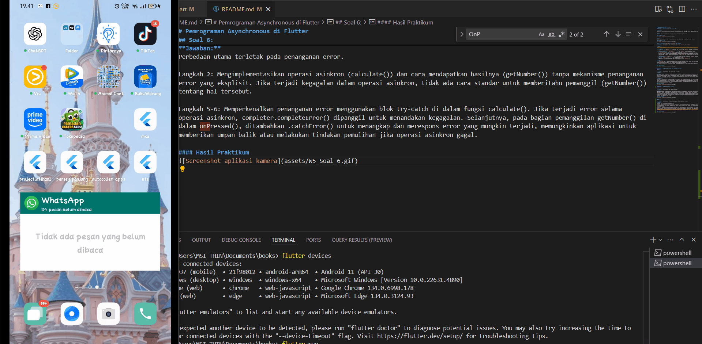
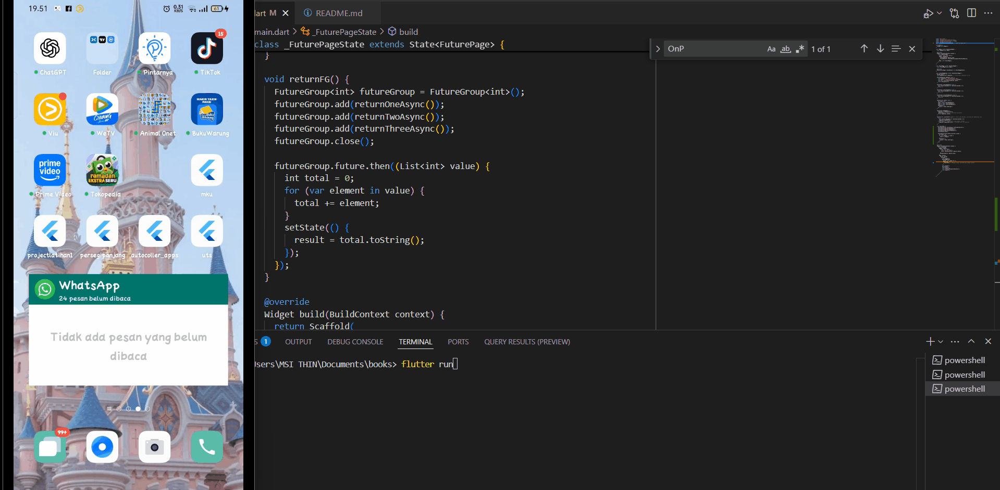
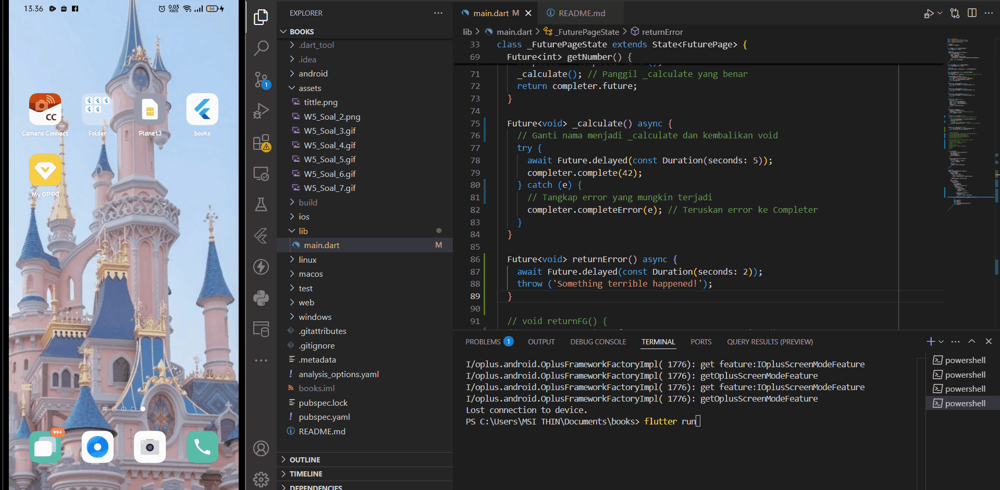
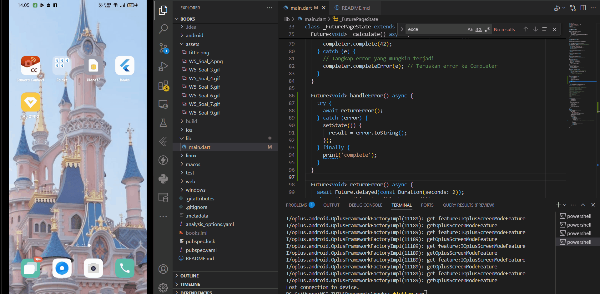
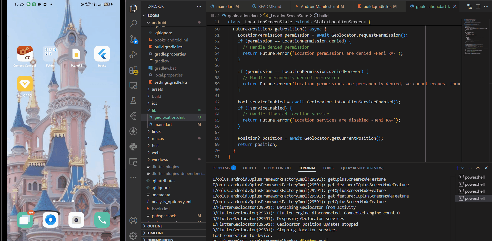
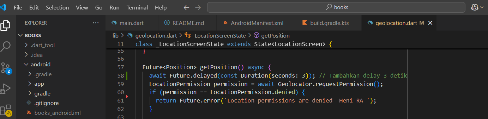
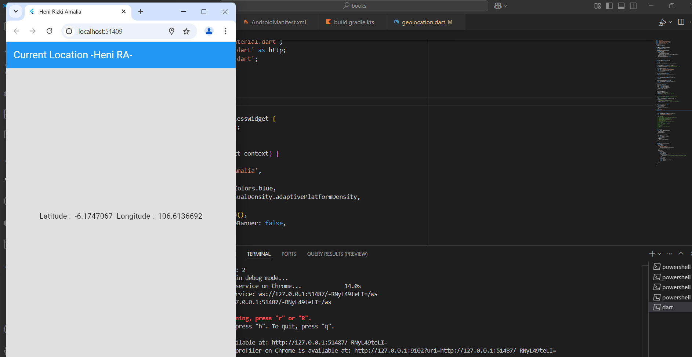
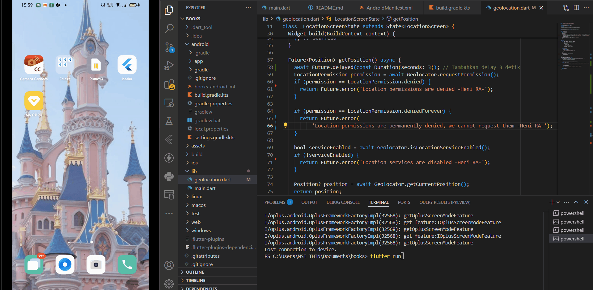
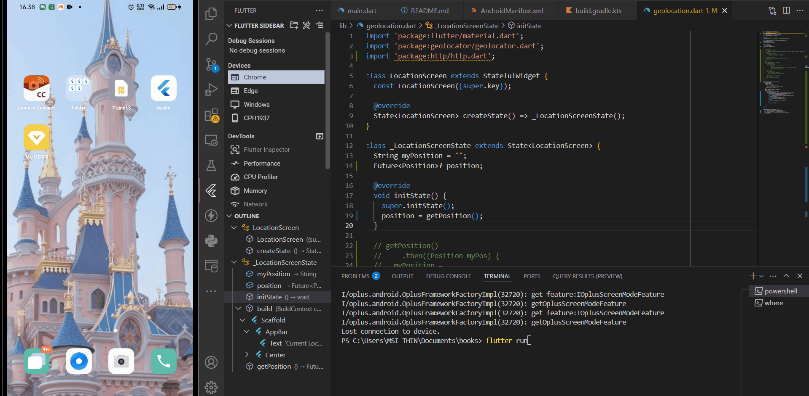

# Pemrograman Asynchronous di Flutter

## PRAKTIKUM 1: Mengunduh Data dari Web Service (API)

**Deskripsi:**

Aplikasi ini mengimplementasikan cara mengambil atau mengunduh data dari sebuah Web Service API menggunakan Flutter.

## Soal 1 :
Tambahkan nama panggilan Anda pada title app sebagai identitas hasil pekerjaan Anda.

#### Mengganti Tittle 

## Soal 2 :
Carilah judul buku favorit Anda di Google Books, lalu ganti ID buku pada variabel path di kode tersebut. 

#### Mengganti ID Buku

## Soal 3: Penjelasan `substring` dan `catchError` pada Langkah 5

**Pertanyaan:** Jelaskan maksud kode langkah 5 tersebut terkait `substring` dan `catchError`!

**Jawaban:**

Kode di dalam blok `onPressed` dari `ElevatedButton` memiliki fungsi utama untuk mengambil data dan menanganinya:

1.  **Pengambilan Data (`getData()`):** Ketika tombol "GO!" ditekan, fungsi `getData()` dipanggil untuk melakukan permintaan data (kemungkinan dari sebuah API). Proses ini bersifat asinkron.

2.  **Penanganan Data Sukses (`.then((value) { ... })`):** Jika `getData()` berhasil mendapatkan respons:
    * `value.body.toString()`: Isi dari respons diubah menjadi format `String`.
    * `.substring(0, 450)`: **Fungsi `substring(0, 450)`** digunakan untuk mengekstrak dan mengambil hanya 450 karakter pertama dari string isi respons. Tujuannya adalah untuk membatasi jumlah data yang ditampilkan atau mengambil cuplikan awal.
    * Hasil potongan string ini kemudian disimpan ke dalam variabel `result` dan ditampilkan pada antarmuka pengguna melalui `setState(() {})`.

3.  **Penanganan Error (`.catchError((_) { ... })`):** Jika terjadi kesalahan selama proses `getData()` (misalnya, koneksi gagal):
    * **Fungsi `catchError((_) { ... })`** akan menangkap error tersebut.
    * Variabel `result` akan diubah menjadi pesan error statis: `"An error occurred"`.
    * Pesan error ini kemudian ditampilkan pada antarmuka pengguna melalui `setState(() {})`.

**Kesimpulan:**

* **`substring(0, 450)`:** Bertugas untuk membatasi dan menampilkan hanya 450 karakter pertama dari data yang berhasil diterima, berguna untuk menyajikan ringkasan atau mencegah tampilan yang terlalu panjang.
* **`catchError((_) { ... })`:** Berfungsi sebagai mekanisme penanganan error. Jika terjadi masalah saat pengambilan data, kode ini akan menampilkan pesan error yang lebih informatif kepada pengguna daripada aplikasi yang berhenti tiba-tiba.

#### Hasil Praktikum

## PRAKTIKUM 2: Menggunakan await/async untuk menghindari callbacks

## Soal 4: 

**Pertanyaan:** Jelaskan maksud kode langkah 1 dan 2 tersebut!

**Jawaban:**

***Langkah 1:** 
Pada langkah pertama ini bertujuan untuk mendefinisikan tiga fungsi asinkron (returnOneAsync, returnTwoAsync, returnThreeAsync) yang masing-masing mensimulasikan operasi yang membutuhkan waktu 3 detik. Setiap fungsi mengembalikan sebuah Future<int> yang akan menghasilkan nilai integer (1, 2, dan 3 secara berurutan) setelah penundaan selesai. Ini mengilustrasikan pembuatan operasi independen yang berjalan secara tidak memblokir.

***Langkah 2:** 
Pada langkah kedua ini yaitu menambahkan fungsi asinkron count() yang menggunakan async dan await untuk memanggil ketiga fungsi dari Langkah 1 secara berurutan. await memastikan bahwa setiap fungsi Future selesai sebelum fungsi berikutnya dipanggil. Hasil dari setiap Future dijumlahkan ke dalam variabel total. Terakhir, setState() digunakan untuk memperbarui tampilan UI dengan nilai total yang telah dikonversi menjadi string, menunjukkan bagaimana mengelola dan menggabungkan hasil dari beberapa operasi asinkron dan merefleksikannya pada antarmuka pengguna.

#### Hasil Praktikum 

## PRAKTIKUM 3: Menggunakan Completer di Future

## Soal 5: 

**Pertanyaan:** Jelaskan maksud kode langkah 2 tersebut!

**Jawaban:**
 Pada Kode Langkah 2 ini memperkenalkan Completer sebagai mekanisme untuk mengelola penyelesaian operasi asinkron secara manual. getNumber() membuat sebuah Completer dan mengembalikan Future yang terkait dengannya. Operasi yang sebenarnya (simulated by calculate()) dilakukan secara terpisah dan, setelah selesai (dalam hal ini, setelah penundaan 5 detik), completer.complete(42) dipanggil untuk menandakan bahwa Future telah berhasil diselesaikan dengan nilai 42. Ini memberikan kontrol eksplisit atas kapan dan bagaimana sebuah Future diselesaikan, yang berguna untuk menangani operasi asinkron yang penyelesaiannya tidak terjadi secara langsung atau dikelola oleh bagian kode yang berbeda.

#### Hasil Praktikum 

## Soal 6: 

**Pertanyaan:** Jelaskan maksud perbedaan kode langkah 2 dengan langkah 5-6 tersebut!

**Jawaban:**
Perbedaan utama terletak pada penanganan error.

Langkah 2: Mengimplementasikan operasi asinkron (calculate()) dan cara mendapatkan hasilnya (getNumber()) tanpa mekanisme penanganan error yang eksplisit. Jika terjadi kegagalan dalam operasi asinkron, tidak ada cara standar untuk memberitahu pemanggil (getNumber()) tentang hal tersebut.

Langkah 5-6: Memperkenalkan penanganan error menggunakan blok try-catch di dalam fungsi calculate(). Jika terjadi error selama operasi asinkron, completer.completeError() dipanggil untuk menandakan kegagalan. Selanjutnya, pada bagian pemanggilan getNumber() di dalam onPressed(), ditambahkan .catchError() untuk menangkap dan merespons error yang mungkin terjadi, memungkinkan aplikasi untuk memberikan umpan balik atau melakukan tindakan pemulihan jika operasi asinkron gagal.

#### Hasil Praktikum 

## PRAKTIKUM 4: Memanggil Future secara paralel

## Soal 7: 

**Penjelasan:** Anda akan melihat hasilnya dalam 3 detik berupa angka 6 lebih cepat dibandingkan praktikum sebelumnya menunggu sampai 9 detik.

#### Hasil Praktikum 

## Soal 8: 

**Pertanyaan:** Jelaskan maksud perbedaan kode langkah 1 dan 4!

**Jawaban:**
returnFG() dengan FutureGroup: seperti membuat wadah (futureGroup), memasukkan setiap operasi asinkron (returnOneAsync, returnTwoAsync, returnThreeAsync) ke dalamnya satu per satu, lalu memberi tahu bahwa tidak ada lagi yang akan ditambahkan (close()).  kemudian menunggu hasilnya dari wadah tersebut.

Future.wait([returnOneAsync(), returnTwoAsync(), returnThreeAsync()]): seperti langsung membuat daftar berisi semua operasi asinkron yang ingin Anda tunggu dan memberikannya ke Future.wait.

Jadi, intinya adalah:

Jika anda sudah memiliki semua operasi asinkron yang ingin dijalankan paralel dalam sebuah daftar, Future.wait adalah cara yang lebih langsung dan ringkas.
Jika Anda perlu menambahkan operasi asinkron secara bertahap atau mungkin tidak tahu semua operasi di awal, FutureGroup memberikan fleksibilitas lebih.

## PRAKTIKUM 5: Menangani Respon Error pada Async Code

## Soal 9: 

**Penjelasan:**
Praktikum 5 ini menunjukkan cara menggunakan Future untuk melakukan operasi asinkron (returnError) yang sengaja dibuat untuk gagal. Kita kemudian menggunakan .then() untuk menangani keberhasilan (yang tidak akan terjadi di sini), .catchError() untuk menangkap dan menampilkan pesan error, dan .whenComplete() untuk menjalankan kode setelah Future selesai, terlepas dari keberhasilan atau kegagalan. Tujuannya adalah untuk mengilustrasikan pola penanganan hasil dan error dalam pemrograman asinkron di Flutter 

#### Hasil Praktikum 

## Soal 10: 

**Pertanyaan:** Jelaskan maksud perbedaan kode langkah 1 dan 4!

**Jawaban:**

Perbedaan Langkah 1 dan Langkah 4:

***Langkah 1:*** 
Mendeklarasikan fungsi returnError(), yang akan menunggu selama 2 detik (Future.delayed) sebelum melemparkan sebuah exception (throw Exception).
Langkah 1 tidak memiliki mekanisme penanganan error, hanya melempar error.

***Langkah 4:***
Mendefinisikan fungsi handleError(), yang menangani error dari returnError() menggunakan try-catch-finally. Jika terjadi error, hasilnya akan disimpan dalam setState(), dan program tetap berjalan tanpa crash.
menggunakan try untuk memanggil returnError(), catch untuk menangkap error dan menampilkannya di UI, serta finally untuk mencetak "Complete".

#### Hasil Praktikum 

## PRAKTIKUM 6: Menggunakan Future dengan StatefulWidget

## Soal 11: 

**Pertanyaan:** Tambahkan nama panggilan Anda pada tiap properti title sebagai identitas pekerjaan Anda.

#### Hasil Praktikum 

## Soal 12: 

**Pertanyaan:**
1. Jika Anda tidak melihat animasi loading tampil, kemungkinan itu berjalan sangat cepat. Tambahkan delay pada method getPosition() dengan kode await Future.delayed(const Duration(seconds: 3));

2. Apakah Anda mendapatkan koordinat GPS ketika run di browser? Mengapa demikian?

**Jawaban:**

1. Sudah saya Tambahkan delay pada method getPosition() dengan kode await Future.delayed(const Duration(seconds: 3));
## 

2. saya mendapatkannya ketika running dibrowser, dikarenakan saya menizinkan untuk aktif gps.
akan tetapi, itu kemungkinan besar merupakan perkiraan lokasi yang dihitung oleh browser menggunakan salah satu atau kombinasi dari metode di atas (Wi-Fi, IP, informasi seluler jika ada). Bukan berarti browser secara langsung mengakses chip GPS perangkat Anda seperti yang dilakukan oleh aplikasi native di ponsel.
## 

#### Hasil Praktikum 6

## PRAKTIKUM 7: Manajemen Future dengan FutureBuilder

## Soal 13: 

**Pertanyaan:** Apakah ada perbedaan UI dengan praktikum sebelumnya? Mengapa demikian?

**Jawaban:**
Iya, ada perbedaan dalam tampilan UI antara kedua kode tersebut. Perbedaan utamanya terletak pada bagaimana data lokasi ditampilkan.
Kode lama secara eksplisit memformat latitude dan longitude dengan 7 digit desimal, sementara kode terbaru menampilkan format yang mirip namun tanpa pemformatan eksplisit dalam kode yang diberikan, mengindikasikan kemungkinan perilaku default toString() yang berbeda atau modifikasi kode lain. 
Secara keseluruhan, FutureBuilder merupakan cara yang lebih modern untuk menangani operasi asinkron di Flutter, meskipun mungkin memerlukan langkah tambahan untuk memformat tampilan data sesuai kebutuhan

#### Hasil Praktikum 

## Soal 14: 

**Pertanyaan:** Apakah ada perbedaan UI dengan praktikum sebelumnya? Mengapa demikian?

**Jawaban:**
Iya, ada perbedaan UI dengan langkah sebelumnya setelah menambahkan penanganan error pada FutureBuilder.

Sebelumnya: Jika terjadi error saat mendapatkan lokasi (misalnya, izin ditolak).
UI mungkin tidak memberikan indikasi yang jelas kepada pengguna bahwa telah terjadi kesalahan. Kemungkinan hanya akan menampilkan teks kosong atau tidak ada perubahan setelah indikator loading hilang.

Sekarang (Setelah Penambahan Kode Error): Jika terjadi error saat mendapatkan lokasi, UI akan menampilkan teks: "Something terrible happened!" di tengah layar. Ini memberikan umpan balik yang jelas kepada pengguna bahwa ada masalah dalam mendapatkan lokasi.

#### Hasil Praktikum 

